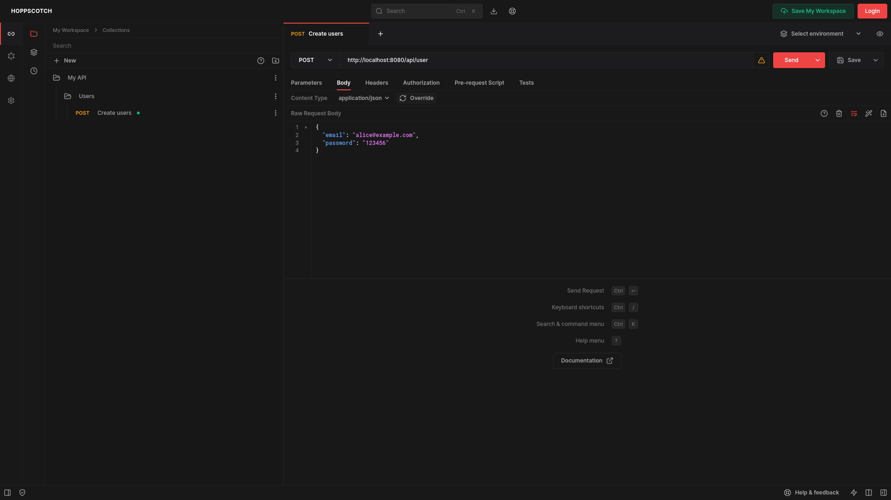

# Hoppscotch docker compose configuration



Docker compose configuration for Hoppscotch. It includes the services:

- Hoppscotch (official image)
- Postgres 16.1 bullseye

## Warning
**This is still not finished**

## Instalation

1. (Optional) Create a `.env` file and configure the settings like in the [official Hoppscotch repository](https://github.com/hoppscotch/hoppscotch/blob/main/.env.example) `.env.example`

```bash
$ touch .env
```

2. Run compose

```bash
$ docker compose up -d
```